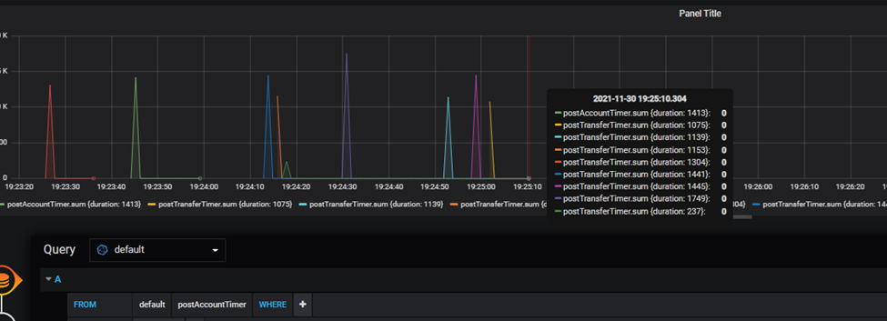

##Oppgave - Devops

###Spørsmål 1:
Beskriv med ord eller skjermbilde  hvordan man kan konfigurere Github på en måte som gir bedre kontroll på utviklingsprosessen. Spesielt med tanke på å hindre kode som ikke kompilerer og feilende tester fra å bli integrert i main branch

###Svar
En kan sette opp en githubAction og sette instrukser i yml filen for å ha bedre kontroll på utviklinsprosessen. Her et eksemepl.
Ved Build Maven vil det gjennom  lifecycles til og med package, og pipelinen vil faile hvis build eller test feiler.

I github er det satt opp branch,protection i main branch som kjører pipelinen på pull request. Dette vil hindre merge til main ved feil i bygg/test. 

Pipelinen kan settes opp som en status check før en kan merge til main

###Spørsmål 2:
Beskriv med ord eller skjermbilder hvordan GitHub kan konfigureres for å sikre at minst ett annet medlem av teamet har godkjent en pull request før den merges.

Ved Settings i github kan en sette opp en slik Branch Protection rule.
Her har settes det slik en trenger en approval fra en annen før det kan merges. 
I tillegg kan det legges til **Dismiss stale pull request approvals when new commits are pushed**. 
Dette vil føre til at ved nyere pull request må da ha en ny review

Include administartors er også en god alternativ å krysse ut, slik at det også vil gjelde for adminstatorer også.

###Spørsmål 3:
Beskriv hvordan arbeidsflyten for hver enkelt utvikler bør være for å få en effektiv som mulig utviklingsprosess, 
spesielt hvordan hver enkelt utvikler bør jobbe med Brancher i Github hver gang han eller hun starter en ny oppgave.

###Svar:

Her har jeg satt opp det kreves at hver feature får en egen branch, og lages en pull request før en kan pushe opp til master. I pull requesten er det krav til at pipelinene passerer og godkjent review.
For hver gang en skal starte med en ny feature, kan det være lurt å sette krav å branche ut fra en oppdatert main.

###Spørsmål 4:

SkalBank har bestemt seg for å bruke DevOps som underliggende prinsipp for all systemutvikling i banken. 
Er fordeling av oppgaver mellom API-teamet og "Team Dino" problematisk med dette som utgangspunkt? 
Hvilke prinsipper er det som ikke etterleves her? Hva er i så fall konsekvensen av dette?

###Svar:

En enkel måte å sørge for god kvalitet er å kreve at merging til main gjøres via pull request, med krav om godkjent review og suksessfullt bygg og kjøring av automatiske tester. Det er viktig å ha gode tester for at dette skal gi full uttelling. Samarbeidet mellom utviklingsteamet og Team Dino må gjøres sterkere. Med så mange manuelle steg og så mye tid fra noe er utviklet til man får tilbakemelding om kvalitet er det stor sjanse for å måtte rette bugs. Dette fører til mye kontekst-switching, som gjør at alt tar mye mer tid for utviklerne. Jo flere bugs som kan oppdages av utviklerne før bygg leveres til Team Dino, jo bedre. Det kan oppnås med å ha god testdekning med automatiske enhetstester, integrasjonstester og ende-til-ende-tester. Bygg bør også automatisk leveres til Team Dino av bygg-pipeline, slik at Jens ikke har dette som en manuell oppgave. Manuelle oppgaver blir glemt, gjort feil, eller ikke gjort i det hele tatt hvis nødvendige personer er borte.

Ci/CD var ikke implementert og tester, drift og dployment skjedde manuelt. Devops prinsippet uten CI/CD er svært lite efektiv.

##Oppgave - Pipeline
spørring(er) kan sensor gjøre mot InfluxDB for å analysere problemet:

**path = "/account/{accountId}"**
SELECT * FROM getAccount
SELECT * FROM getAccountTimer (Duration)
SELECT SUM(*) FROM getAccount group by exception (Exceptions)

**path = "/account/"**
SELECT * FROM postAccount
SELECT * FROM postAccountTimer(Duration)
SELECT SUM(*) FROM postAccount group by exception (Exceptions)

**path = "/account/{fromAccount}/transfer/{toAccount}"**
SELECT * FROM postTransfer
SELECT * FROM postTransferTimer (Duration)
SELECT SUM(*) FROM postTransfer group by exception (Exceptions)
	
**Result of all exceptions**
SELECT Sum(count) FROM postTransfer,postAccount,getAccount  group by exception

Konitnuerlig overvåking er nødvendig for å se om applikasjonen fungerer riktig. 
Anbefaler automatiserte overvåkninger, f.eks.logs traces og metrics.  Dette vil føre at teamet får riktig info å vurdere på.

##Oppgave - TerraForm

###Spørsmål 1:

Hvorfor funket terraformkoden i  dette repoet for Jens første gang det ble kjørt og hvorfor feiler det for alle andre etterpå,
inkludert jens etter han ryddet på disken sin og slettet terraform.tfstate filen

###Svar:
Bucket Navn må være unik. Den er ikke dynamisk, der for får du en feil når bucket allerde eksisterer.

###Spørsmål 2:
Sensor ønsker og lage sin bucket ved hjelp av CLI. Sensor har aws kommandolinje installert på sin lokale maksin. 
Hva må sensor ghjøre for å konfigurere AWS nøkler/Credentials? Anta at sensor sin AWS bruker ikke har nøkler/credentials fra før

###Svar:

1) Logg inn i aws konoen sin vie en browser.
2) Under IAM -> users – Security Credential

Kan en lage acces key ID g secrec Access key ved å trykke på create acces key. Disse må en ikke miste.

3)	Kjør cmd for aws configure.
4)	Legg til Access key og secret access key når det kommer. (må autrisers mot aws)
Skriv deretter kommando 
“aws s3api create-bucket --bucket [bucketname] --region eu-west-1 --create-bucket-configuration LocationConstraint=eu-west-1”

###Spørsmål 3:

Beskriv hva sensor må gjøre etter han/hun har laget en fork for å få pipeline til å fungere for i sin AWS/gitHub konto.

###Svar:

Under Secret i Github må du legge inn access keyd id og aws secret access key.
Dette finner du i aws kontoen.

I Docker.yml endrer du slik at de er din aws den pusher til 

Lag en egen s3bucket i Aws.

provider_tf filen endrer du bucket navn til dit eget-
ecr_repository.tf endrer du til eget

##Oppgave - Docker

###Spørsmål 1
Hva vil kommandolinje for å bygge et container image være? 

###Svar:
Docker build -t [namecontainer]

###Spørsmål 2
Hva vil kommando for å starte en container være? Applikasjonen skal lytte på port 7777 på din maskin. 
###Svar:
docker run -dp 7777:8080 [namecontainer]

###Spørsmål 3
Medlemmer av "Team Dino" har av og til behov for å kjøre to ulike versjoner av applikasjonen lokalt på maskinen sin, samtidig .Hvordan kan de gjøre dette uten å få en port-konflikt? Hvilke to kommandoer kan man kjøre for å starte samme applikasjon to ganger, hvor den ene bruker port 7777 og den andre 8888?

###Svar:
docker run -dp 7777:8080 [namecontainer]
docker run -dp 8888:8080 [namecontainer]
